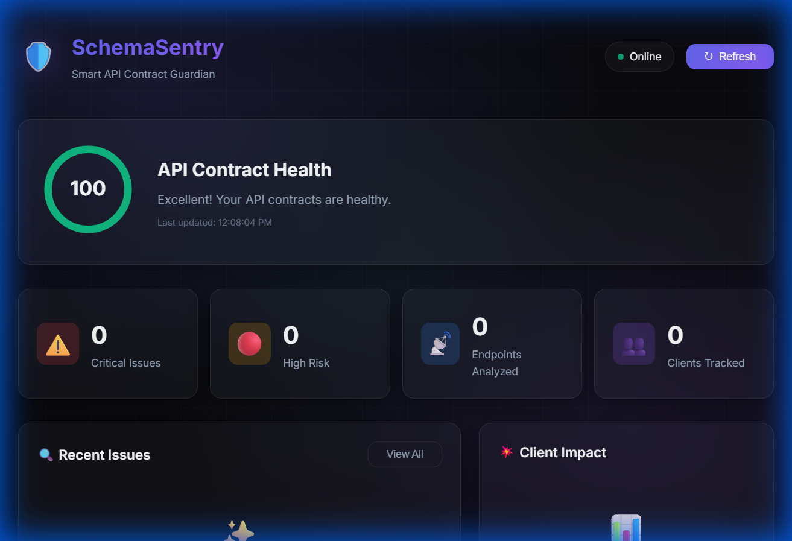
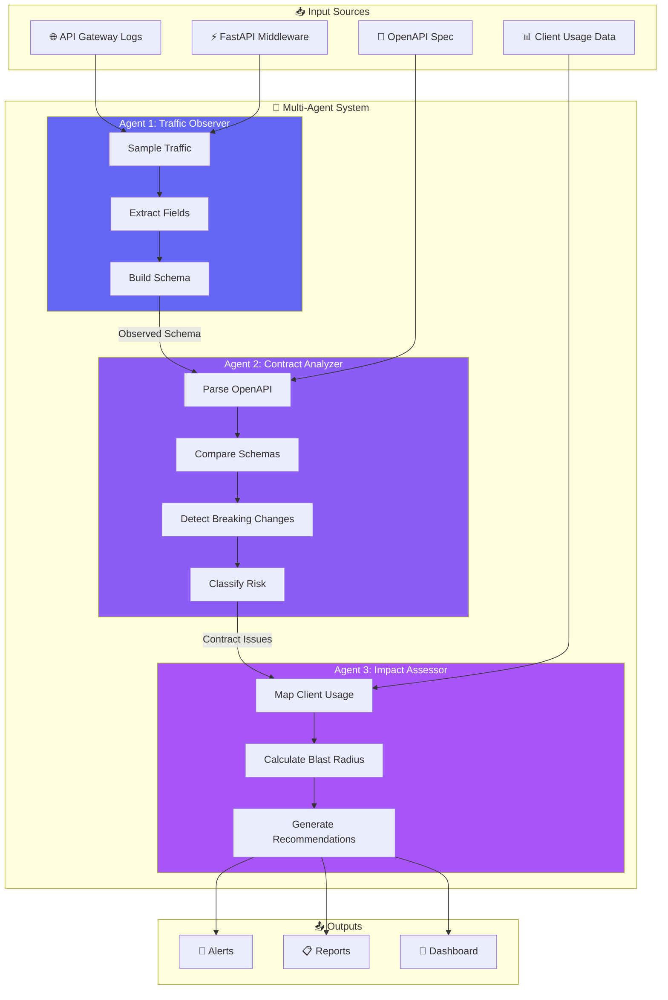
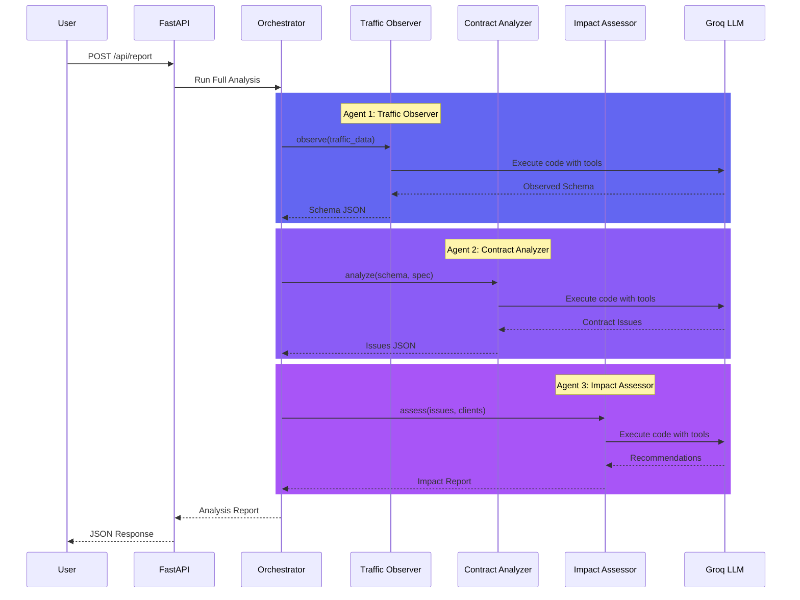
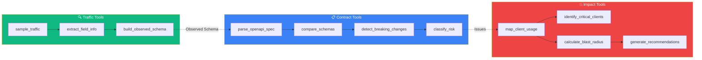
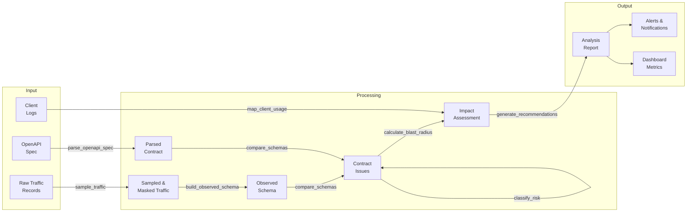

# 🛡️ SchemaSentry - Smart API Contract Guardian

**Detect breaking API changes before clients do.**

[](https://www.python.org/downloads/)
[](https://fastapi.tiangolo.com/)
[](https://huggingface.co/docs/smolagents)
[](https://groq.com/)

---

## 📸 Dashboard Preview



*Premium dark-mode dashboard with glassmorphism design, real-time health monitoring, and contract issue visualization.*

---

## 🎯 What Problem Does It Solve?

In real backend systems:
- 📉 APIs drift from OpenAPI specs over time
- 🔒 Fields silently become required or optional
- 🔄 Response shapes change without documentation
- 💥 **Clients break after deployment**

SchemaSentry continuously observes real traffic, compares it against declared contracts, and flags breaking or risky changes **before they reach production**.

> *This is not a toy. Platform teams pay for this.*

---

## 🏗️ System Architecture



---

## 🔄 Agent Workflow



---

## 🛠️ Tool Architecture



---

## 📊 Data Flow



---

## 🤖 The Three Agents

### Agent 1: Traffic Observer 🔍

**Responsibility**: Observe real API traffic and build observed contracts.

| Tool | Purpose |
|------|---------|
| `sample_traffic` | Sample at configurable rate with PII masking |
| `extract_field_info` | Extract types, nullability from payloads |
| `build_observed_schema` | Aggregate into schema with presence rates |

**Output Example:**
```json
{
  "endpoint": "POST /patients",
  "observed_fields": {
    "id": {"type": "string", "presence_rate": 1.0},
    "insurance": {"type": "object", "presence_rate": 0.42, "nullable": true}
  }
}
```

### Agent 2: Contract Analyzer 📋

**Responsibility**: Compare observed schema vs OpenAPI spec.

| Tool | Purpose |
|------|---------|
| `parse_openapi_spec` | Parse YAML/JSON OpenAPI specs |
| `compare_schemas` | Detect drifts between observed/declared |
| `detect_breaking_changes` | Filter critical breaking issues |
| `classify_risk` | LLM-enhanced risk explanations |

**Output Example:**
```json
{
  "issue_type": "BREAKING_CHANGE",
  "endpoint": "GET /eligibility",
  "detail": "Field 'coverage_status' missing in 37% of responses",
  "risk": "CRITICAL"
}
```

### Agent 3: Impact Assessor 💥

**Responsibility**: Answer "Who will break if this ships?"

| Tool | Purpose |
|------|---------|
| `map_client_usage` | Map endpoints to consuming clients |
| `identify_critical_clients` | Score client priority |
| `calculate_blast_radius` | Count affected clients |
| `generate_recommendations` | Create actionable suggestions |

**Output Example:**
```json
{
  "affected_clients": ["billing-service", "frontend-app"],
  "confidence": 0.82,
  "blast_radius": 3,
  "recommended_action": "STOP DEPLOYMENT. Fix breaking changes."
}
```

---

## 🚀 Quick Start

### 1. Clone and Install

```bash
cd SchemaSentry
python -m venv .venv
.venv\Scripts\activate  # Windows
# source .venv/bin/activate  # Mac/Linux

pip install -r requirements.txt
```

### 2. Configure

```bash
copy .env.example .env
# Edit .env and add your Groq API key
# Get one at: https://console.groq.com/keys
```

**Example `.env`:**
```bash
GROQ_API_KEY=gsk_your_api_key_here
GROQ_MODEL=groq/llama-3.3-70b-versatile
```

### 3. Run

```bash
python main.py
```

**Access:**
- 🎨 **Dashboard**: http://localhost:8000/
- 📖 **API Docs**: http://localhost:8000/docs

---

## 📡 API Endpoints

| Endpoint | Method | Description |
|----------|--------|-------------|
| `/health` | GET | Service health check |
| `/api/observe` | POST | Submit traffic for observation |
| `/api/analyze` | POST | Analyze contract drift |
| `/api/assess` | POST | Assess client impact |
| `/api/report` | POST | Generate full analysis report |
| `/api/issues` | GET | List detected issues |
| `/api/dashboard-data` | GET | Dashboard metrics |

---

## 📁 Project Structure

```
SchemaSentry/
├── 📄 main.py                    # Entry point
├── 📄 sample_api.py              # Test API with drifts
├── 📄 requirements.txt           # Dependencies
├── 📁 api/
│   └── main.py                   # FastAPI application
├── 📁 src/
│   ├── config.py                 # Configuration
│   ├── 📁 agents/                # AI Agents
│   │   ├── traffic_observer.py
│   │   ├── contract_analyzer.py
│   │   ├── impact_assessor.py
│   │   └── orchestrator.py
│   ├── 📁 tools/                 # Agent Tools
│   │   ├── traffic_tools.py
│   │   ├── contract_tools.py
│   │   └── impact_tools.py
│   ├── 📁 models/                # Pydantic Schemas
│   └── 📁 utils/                 # Utilities
├── 📁 ui/                        # Dashboard UI
├── 📁 docs/                      # Documentation
└── 📁 tests/                     # Test Data
```

---

## 🧪 Testing

A sample Patient API with **intentional contract drifts** is included:

```bash
# Terminal 1: Run the test API (port 8001)
python sample_api.py

# Terminal 2: Run SchemaSentry (port 8000)
python main.py
```

The sample API has these drifts for testing:
- `coverage_status` sometimes missing (40%)
- `insurance` sometimes null unexpectedly
- `internal_score` undocumented field appears

---

## 🛠️ Technology Stack

| Component | Technology |
|-----------|------------|
| Agent Framework | [smolagents](https://huggingface.co/docs/smolagents) |
| LLM Provider | [Groq](https://groq.com/) (llama-3.3-70b-versatile) |
| Backend | FastAPI + Uvicorn |
| Data Models | Pydantic v2 |
| Frontend | Vanilla HTML/CSS/JS |

---

## 🔮 Future Roadmap

- [ ] Webhook notifications (Slack, Teams, Discord)
- [ ] GitHub PR comments
- [ ] Historical trend analysis
- [ ] Multi-environment support
- [ ] OpenTelemetry integration
- [ ] CI/CD pipeline integration

---

## 📄 License

MIT License - Feel free to use in your projects!

---

<p align="center">
  <b>Built with 🤖 smolagents + ⚡ Groq</b>
</p>
